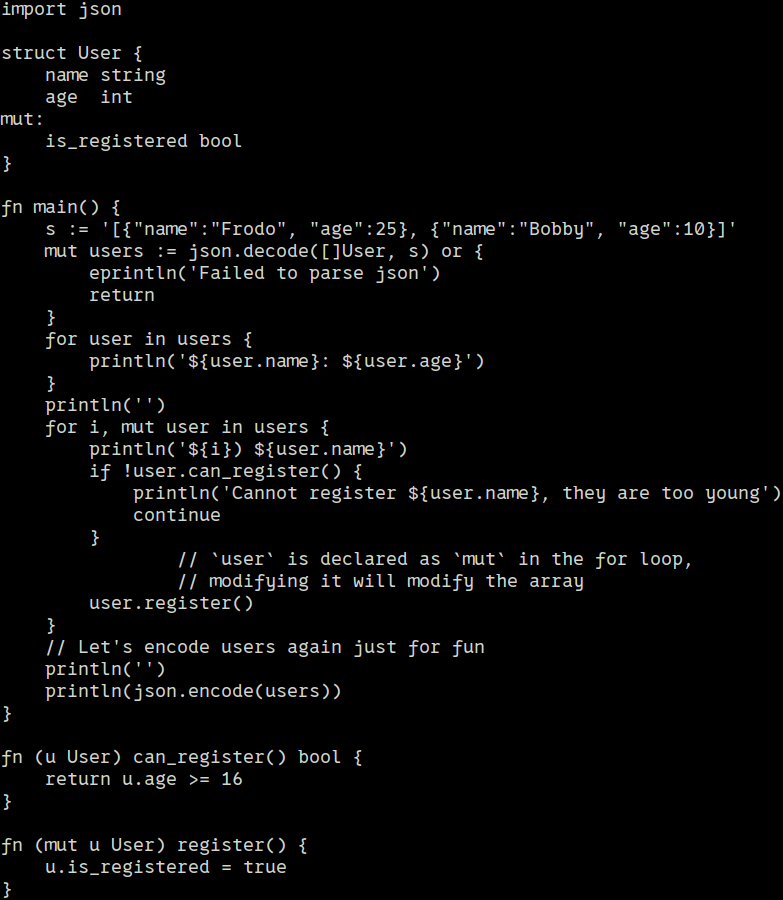
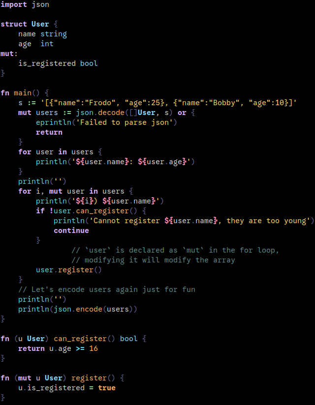

# v-vim
Syntax highlighting for the V programming language

Save the `v.vim` file in the following path:

`~/.vim/syntax/`

Add the following line to your `.vimrc` file:

`autocmd BufRead,BufNewFile *.v set filetype=v‍‍`

  
  

